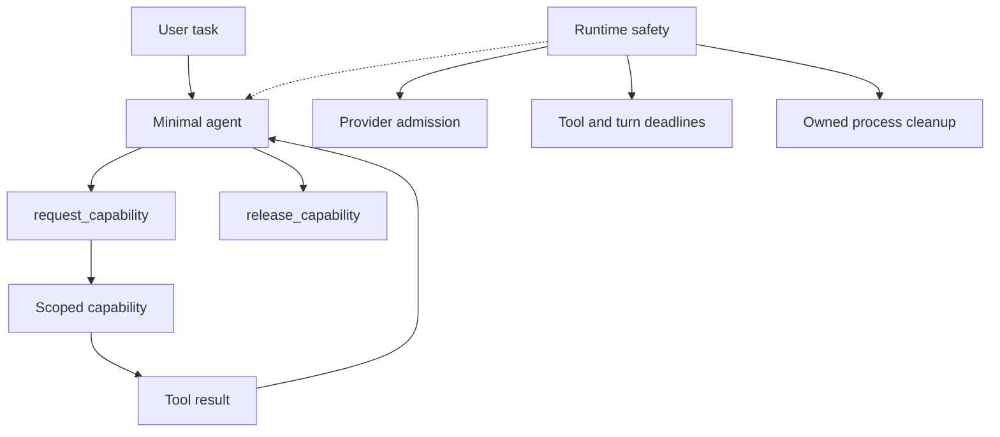

# Architecture

Minimal Omni has two planes:

1. The official Minimal brain and its per-session preset.
2. The environment around it: capabilities that are leased on demand and
   runtime boundaries that keep tools and processes contained.

The public bundle adds a Host/root governor row and a package-shipped
Minimal Omni preset root to the existing DSH Web profile. The preset contains
the capability broker and the small idle tool surface. Standard remains the
profile default unless a user selects Minimal Omni for a session.

The governor has two modes. Community normal mode is inert unless a maintainer
explicitly supplies acceptance settings; it does not impose a hidden request
cap or isolated home. Maintainer acceptance mode enables the ledger, home
isolation, and fail-closed admission checks used by this project's tests.

The runtime uses a tool deadline before a turn deadline, with an external
watchdog as the last resort. Browser, jobs, downloads, screenshots, and
document extraction use owned paths and bounded results.

Minimal Omni deliberately does not add a planner, reviewer loop, automatic
workflow, or automatic memory injection.
